# 🛍️ KindKart

KindKart is a full-stack web platform that promotes kindness through sharing and donating.  
Users can donate **food, clothes, and toys** to people in need — creating a bridge between donors and NGOs.

---

## 🌟 Features
- 🥗 Donate or request **food, clothes, and toys**
- 🧭 Real-time updates for available donations
- 💬 Simple and modern user interface
- ⚙️ Secure backend with MongoDB and JWT authentication
- 🌐 Built with **MERN Stack (MongoDB, Express, React, Node.js)**

---

## 🚀 Tech Stack

| Frontend | Backend | Database | Authentication |
|-----------|----------|-----------|----------------|
| React.js  | Node.js + Express.js | MongoDB Atlas | JWT |

---

## 🧩 Folder Structure

```
KindKart/
 ┣ frontend/      # React app (UI)
 ┣ backend/       # Express server and API routes
 ┣ package.json   # Project dependencies
 ┣ README.md      # You’re here!
```

---

## ⚙️ Installation and Setup

1. **Clone the repository**
   ```bash
   git clone https://github.com/Vennela2413/KindKart.git
   cd KindKart
   ```

2. **Install dependencies**
   ```bash
   npm install
   cd frontend
   npm install
   cd ../backend
   npm install
   ```

3. **Set up environment variables**
   Create a `.env` file in the `backend` folder:
   ```bash
   MONGO_URI=your_mongodb_connection_string
   JWT_SECRET=your_secret_key
   ```

4. **Run the app**
   - Backend: `npm start`
   - Frontend: `npm start` (inside the `frontend` folder)

---

## 📸 Screenshots 

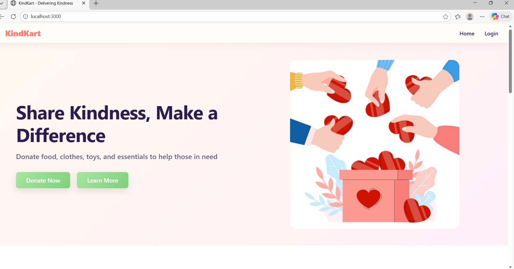
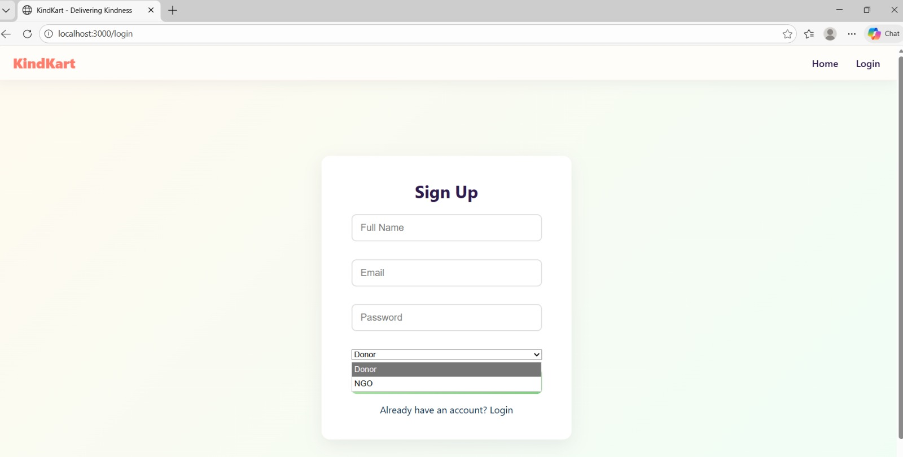
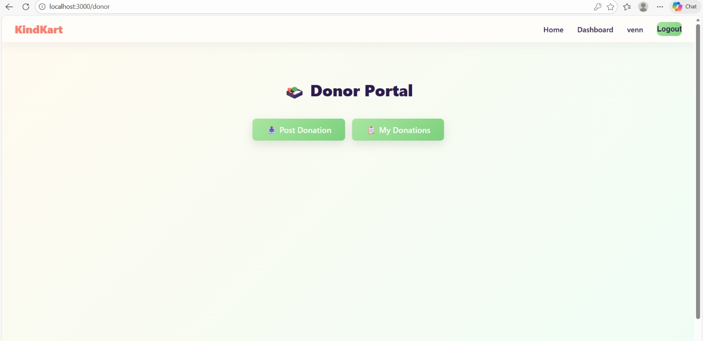
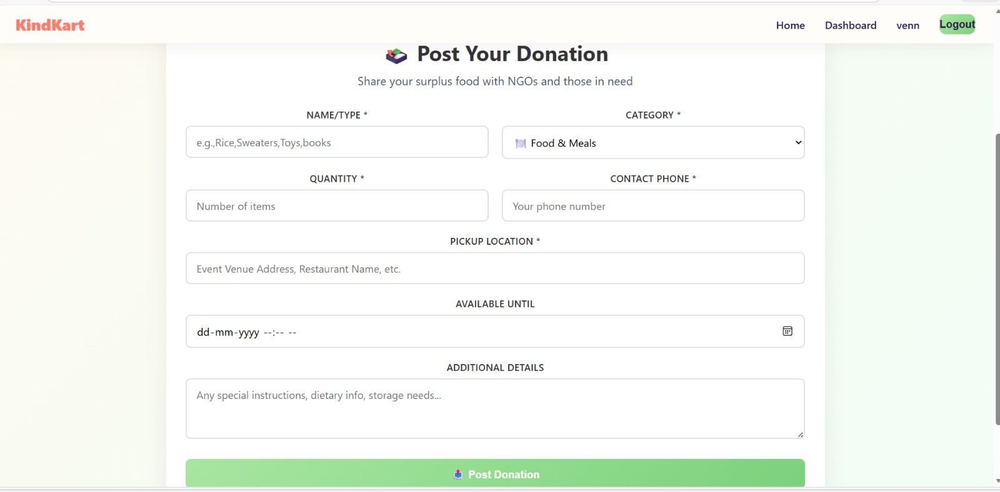
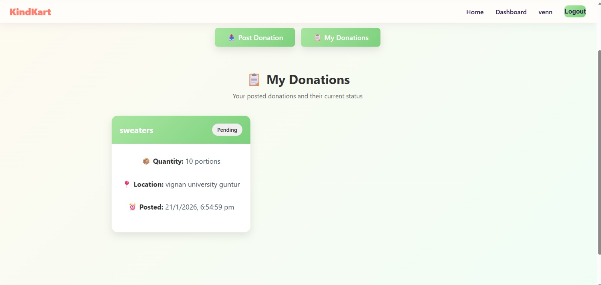
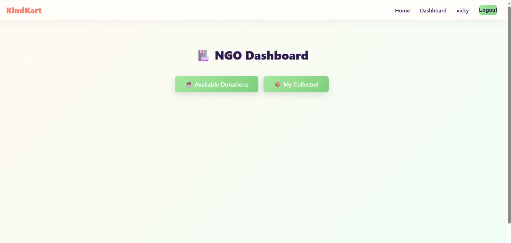
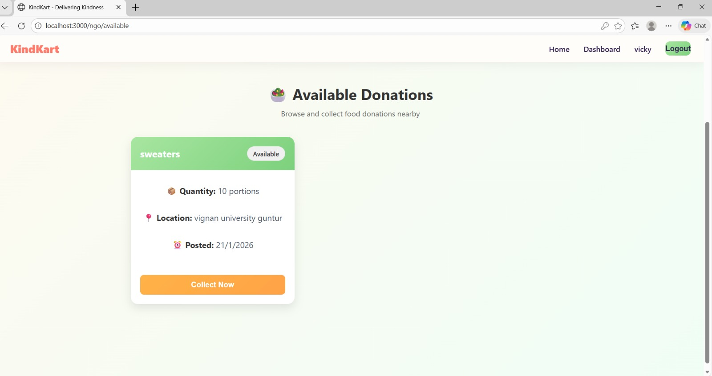
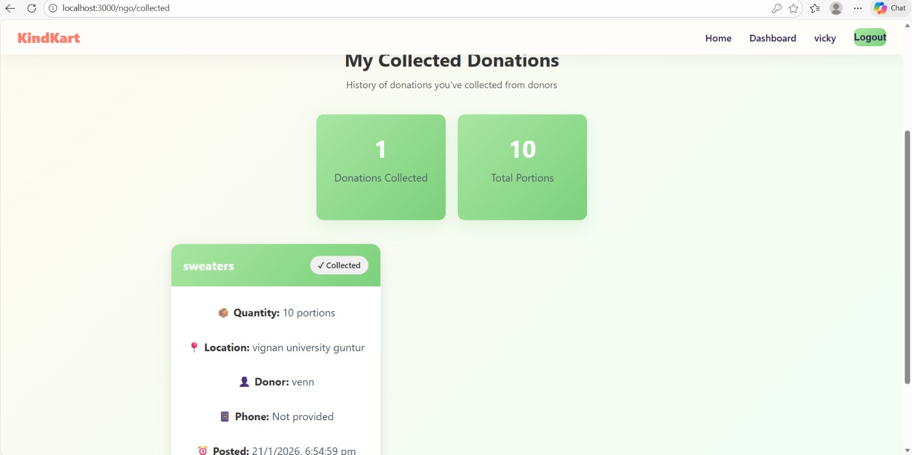
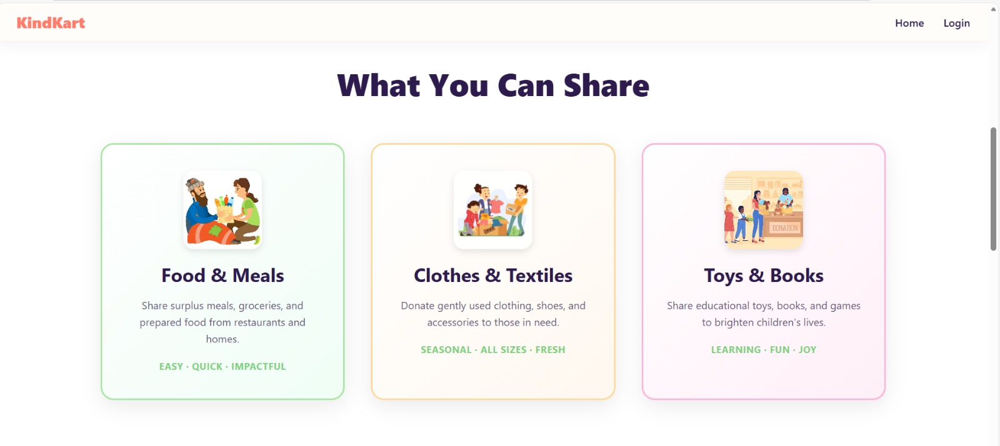
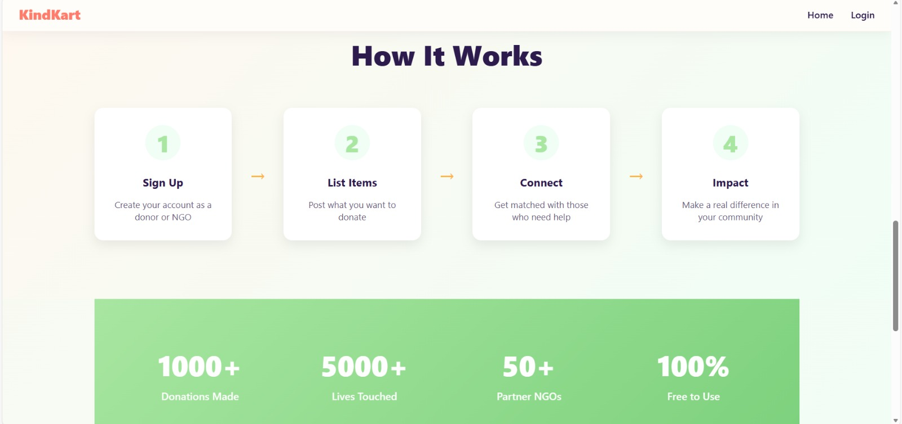
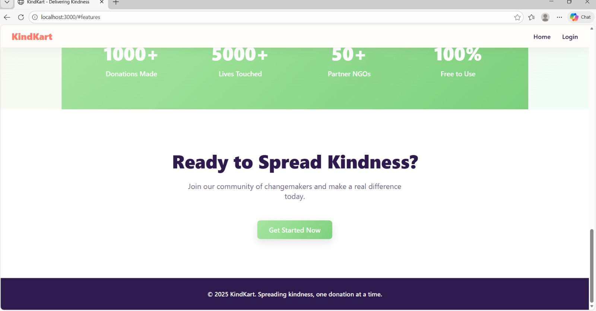


---

## ❤️ Contributing
Contributions are welcome!  
If you’d like to improve KindKart, feel free to fork this repo and create a pull request.

---

## 🧑‍💻 Author
**Developed by [Vennela2413](https://github.com/Vennela2413)**  
✨ With love and kindness.

---

## 📜 License
This project is licensed under the **MIT License** — free to use and modify.
